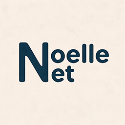

<p align="center">
  
</p>

# Noelle.Net

这是辅助 .NET 开发的小类库～ 平时顺手攒的小零件都在这儿了，希望能帮你少敲几行重复代码！(｡•̀ᴗ-)✧

[](https://www.nuget.org/packages/NoelleNet.Core)
[](LICENSE)
[](https://dotnet.microsoft.com/)

---

## 一些约定

- 不深度封装 ASP.NET Core，只用原生能力能接得上的方式做增强；
- 依赖注入全部显式注册，没有模块化与自动装配；
- 尽量使用成熟组件，例如事件总线基于 MediatR / CAP，验证基于 FluentValidation，数据访问基于 EF Core；

---

## 功能说明

| 能力 | 说明 | 所在包 |
|------|------|--------|
| DDD 领域模型 | `Entity` / `AggregateRoot` / `ValueObject` 基类、领域事件 | `NoelleNet.Ddd.Domain` |
| 审计追踪 | 创建时间/创建人/修改时间/修改人自动填充 | `NoelleNet.Auditing` + `NoelleNet.EntityFrameworkCore` |
| EF Core 仓储 | `EfCoreRepository<T>` 薄封装，内置审计/领域事件/GUID 拦截器 | `NoelleNet.EntityFrameworkCore` |
| 工作单元与事务 | `IUnitOfWork` / `ITransactionManager`，支持 CAP 事务发件箱 | `NoelleNet.Uow` + `NoelleNet.Extensions.CAP.*` |
| 事件总线 | 本地（MediatR）+ 分布式（CAP），统一抽象、按接口自动发现处理器 | `NoelleNet.EventBus.*` |
| 全局异常处理 | 异常自动转为 RFC 9457 ProblemDetails，支持错误码本地化 | `NoelleNet.AspNetCore` |
| 模型验证 | DataAnnotations 绑定验证 + FluentValidation 业务验证，统一错误格式 | `NoelleNet.AspNetCore` |
| 安全主体 | `ICurrentUser` 统一访问当前用户（OIDC 短名声明） | `NoelleNet.Core` |
| 应用 DTO | 分页 / 排序 / 列表结果等通用对象 | `NoelleNet.Application.Contracts` |
| MediatR 行为管道 | 命令日志、事务自动管理 | `NoelleNet.Extensions.MediatR` |

---

## 快速开始

装上要用的包：

```bash
dotnet add package NoelleNet.Ddd.Domain
dotnet add package NoelleNet.EntityFrameworkCore
dotnet add package NoelleNet.AspNetCore
dotnet add package NoelleNet.EventBus.Local.MediatR
```

领域实体继承审计聚合根，自带 `Id` 与审计字段：

```csharp
public class TodoItem : AuditedAggregateRoot<Guid>
{
    protected TodoItem() { }   // EF Core 专用

    public TodoItem(string title)
    {
        if (string.IsNullOrWhiteSpace(title))
            throw new BusinessException("A01108", "待办事项标题不能为空");

        Id = Guid.CreateVersion7();
        Title = title;
    }

    public string Title { get; set; } = null!;
    public bool IsCompleted { get; set; }

    public void Complete() => IsCompleted = true;
}
```

服务注册没有自动装配，一行行写清楚就好：

```csharp
builder.Services.AddScoped<IUnitOfWork, UnitOfWork>();
builder.Services.AddScoped<ITransactionManager, NoelleTransactionManager>();
builder.Services.AddLocalEventBus(cfg => cfg.UseMediatR(x => x.RegisterServicesFromAssemblies(assembly)));
builder.Services.AddDbContext<DbContext, AppDbContext>((sp, options) => options.UseNpgsql(connectionString));
```

各模块的注册骨架（异常处理、验证过滤器、三个拦截器、事件总线）与用法细节见 [docs/packages/](docs/packages/)，按包装订成 14 篇。

---

## 几点补充

- **异常**：`BusinessException` → 400，`EntityNotFoundException` → 404，`DBConcurrencyException` → 409，其余未处理异常 → 500；
- **验证**：`NoelleModelValidationFilter`（DataAnnotations）与 `NoelleFluentValidationFilter`（FluentValidation）二选一，两者都记得设 `SuppressModelStateInvalidFilter = true`；
- **领域事件**：在 `SaveChanges` 提交前派发，处理器在事务内执行，别在处理器里再调一次 `SaveChanges`；短信、HTTP 这类外部副作用请走分布式事件；
- **事务**：配上 `NoelleTransactionBehavior` 后，命令处理器不用自己调 `SaveChanges`；需要消息与数据原子提交时，把 `ITransactionManager` 换成 `NoelleCapTransactionManager`。

---

## 本地开发

```powershell
dotnet build framework/Noelle.Net.slnx     # 构建
dotnet test  framework/Noelle.Net.slnx     # 测试

cd nupkg && ./pack.ps1                     # 打包（默认先跑测试，-SkipTests 跳过，-Push 推送）
```

需要 **.NET 10 SDK**（CI 与发布流水线使用 `10.0.x`）。欢迎通过 [Issues](https://github.com/xiaolong233/noelle-net/issues) 反馈问题或提 PR。

[MIT](LICENSE) © 2024 [xiaolong233](https://github.com/xiaolong233)
